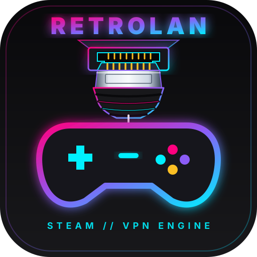

  
  <h1>🌐 RetroLAN-VPN</h1>
  
<b>Zero-Config Layer 2/3 LAN & Steam Relay VPN Engine for Classic & Modern Gaming</b>

  
<i>[ <a href="README_DE.md">🇩🇪 Auf Deutsch lesen / Read in German</a> ]</i>

---

## 🚀 About The Project
RetroLAN-VPN bridges the gap between retro LAN gaming and modern network security. Built with **Rust, WireGuard (`boringtun`/`Wintun`), and Steamworks**, it combines high-speed User-Space Layer 3 encryption with an automated Layer 2 UDP broadcast reflector.

### ✨ Key Features
* **Zero-Config NAT & IPv6 Traversal:** Automatically routes via IPv6 P2P, IPv4 STUN hole-punching, or seamlessly falls back to Valve's global **Steam Relay Network (SDR)** to bypass DS-Lite and CGNAT.
* **IPX-to-UDP Wrapping:** Intercepts retro IPX/SPX packets via a lightweight `wsock32.dll` hook and tunnels them over modern IPv4.
* **Linux-First & Proton Manager:** Auto-injects `WINE_BIND_IP` bindings and automatically downloads compatibility tools like **Proton-GE** or **Proton-CachyOS**.
* **Clean OS Footprint:** Strict Subnet-Only Routing (Split-Tunneling) keeps your regular browser and Discord traffic untouched. Auto-cleans virtual adapters on exit.
* **Offline LAN Mode:** Physical local discovery via mDNS for true basement LAN parties without internet or Steam.
* **Drop-in Modding & i18n:** Add games via `games.toml` or translations via `locales/*.toml` without compiling a single line of code.

---

## ⚖️ License & Acknowledgments
Distributed under the MIT License. See `LICENSE` for more information.
For attributions regarding WireGuard, BoringTun, Wintun, Steamworks, and Wine/Proton, please see [`THIRD_PARTY_NOTICES.md`](THIRD_PARTY_NOTICES.md).
